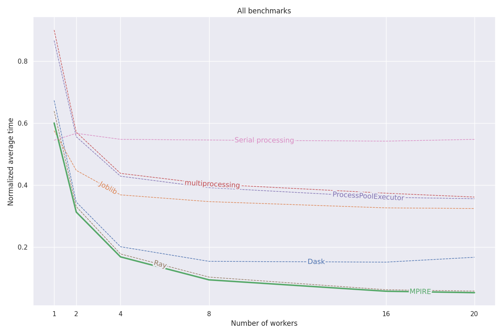

MPIRE (MultiProcessing Is Really Easy)
======================================

|Build status| |Docs status| |Pypi status| |Python versions|

.. |Build status| image:: https://github.com/sybrenjansen/mpire/workflows/Build/badge.svg?branch=master
    :target: https://github.com/sybrenjansen/mpire/actions/workflows/python-package.yml
    :alt: Build status
.. |Docs status| image:: https://github.com/sybrenjansen/mpire/workflows/Docs/badge.svg?branch=master
    :target: https://sybrenjansen.github.io/mpire/
    :alt: Documentation
.. |PyPI status| image:: https://img.shields.io/pypi/v/mpire
    :target: https://pypi.org/project/mpire/
    :alt: PyPI project page
.. |Python versions| image:: https://img.shields.io/pypi/pyversions/mpire
    :target: https://pypi.org/project/mpire/
    :alt: PyPI project page

``MPIRE``, short for MultiProcessing Is Really Easy, is a Python package for multiprocessing. ``MPIRE`` is faster in
most scenarios, packs more features, and is generally more user-friendly than the default multiprocessing package. It
combines the convenient map like functions of ``multiprocessing.Pool`` with the benefits of using copy-on-write shared
objects of ``multiprocessing.Process``, together with easy-to-use worker state, worker insights, worker init and exit
functions, timeouts, and progress bar functionality.

Full documentation is available at https://sybrenjansen.github.io/mpire/.

Features
--------

- Faster execution than other multiprocessing libraries. See benchmarks_.
- Intuitive, Pythonic syntax
- Multiprocessing with ``map``/``map_unordered``/``imap``/``imap_unordered``/``apply``/``apply_async`` functions
- Easy use of copy-on-write shared objects with a pool of workers (copy-on-write is only available for start method
  ``fork``)
- Each worker can have its own state and with convenient worker init and exit functionality this state can be easily
  manipulated (e.g., to load a memory-intensive model only once for each worker without the need of sending it through a
  queue)
- Progress bar support using tqdm_
- Progress dashboard support
- Worker insights to provide insight into your multiprocessing efficiency
- Graceful and user-friendly exception handling
- Timeouts, including for worker init and exit functions
- Automatic task chunking for all available map functions to speed up processing of small task queues (including numpy
  arrays)
- Adjustable maximum number of active tasks to avoid memory problems
- Automatic restarting of workers after a specified number of tasks to reduce memory footprint
- Nested pool of workers are allowed when setting the ``daemon`` option
- Child processes can be pinned to specific or a range of CPUs
- Optionally utilizes dill_ as serialization backend through multiprocess_, enabling parallelizing more exotic objects,
  lambdas, and functions in iPython and Jupyter notebooks.

MPIRE has been tested on both Linux and Windows. There are a few minor known caveats for Windows users, which can be
found here_.

.. _benchmarks: https://towardsdatascience.com/mpire-for-python-multiprocessing-is-really-easy-d2ae7999a3e9
.. _multiprocess: https://github.com/uqfoundation/multiprocess
.. _dill: https://pypi.org/project/dill/
.. _tqdm: https://tqdm.github.io/
.. _here: https://sybrenjansen.github.io/mpire/troubleshooting.html#windows

Installation
------------

Through pip (PyPi):

.. code-block:: bash

    pip install mpire

MPIRE is also available through conda-forge:

.. code-block:: bash

    conda install -c conda-forge mpire

Getting started
---------------

Suppose you have a time consuming function that receives some input and returns its results. Simple functions like these
are known as `embarrassingly parallel`_ problems, functions that require little to no effort to turn into a parallel
task. Parallelizing a simple function as this can be as easy as importing ``multiprocessing`` and using the
``multiprocessing.Pool`` class:

.. _embarrassingly parallel: https://en.wikipedia.org/wiki/Embarrassingly_parallel

.. code-block:: python

    import time
    from multiprocessing import Pool

    def time_consuming_function(x):
        time.sleep(1)  # Simulate that this function takes long to complete
        return ...

    with Pool(processes=5) as pool:
        results = pool.map(time_consuming_function, range(10))

MPIRE can be used almost as a drop-in replacement to ``multiprocessing``. We use the ``mpire.WorkerPool`` class and
call one of the available ``map`` functions:

.. code-block:: python

    from mpire import WorkerPool

    with WorkerPool(n_jobs=5) as pool:
        results = pool.map(time_consuming_function, range(10))

The differences in code are small: there's no need to learn a completely new multiprocessing syntax, if you're used to
vanilla ``multiprocessing``. The additional available functionality, though, is what sets MPIRE apart.

Progress bar
~~~~~~~~~~~~

Suppose we want to know the status of the current task: how many tasks are completed, how long before the work is ready?
It's as simple as setting the ``progress_bar`` parameter to ``True``:

.. code-block:: python

    with WorkerPool(n_jobs=5) as pool:
        results = pool.map(time_consuming_function, range(10), progress_bar=True)

And it will output a nicely formatted tqdm_ progress bar.

MPIRE also offers a dashboard, for which you need to install additional dependencies_. See Dashboard_ for more
information.

.. _dependencies: https://sybrenjansen.github.io/mpire/install.html#dashboard
.. _Dashboard: https://sybrenjansen.github.io/mpire/usage/dashboard.html

Shared objects
~~~~~~~~~~~~~~

Note: Copy-on-write shared objects is only available for start method ``fork``. For ``threading`` the objects are shared
as-is. For other start methods the shared objects are copied once for each worker, which can still be better than once
per task.

If you have one or more objects that you want to share between all workers you can make use of the copy-on-write
``shared_objects`` option of MPIRE.  MPIRE will pass on these objects only once for each worker without
copying/serialization. Only when you alter the object in the worker function it will start copying it for that worker.

.. code-block:: python

    def time_consuming_function(some_object, x):
        time.sleep(1)  # Simulate that this function takes long to complete
        return ...

    def main():
        some_object = ...
        with WorkerPool(n_jobs=5, shared_objects=some_object) as pool:
            results = pool.map(time_consuming_function, range(10), progress_bar=True)

See shared_objects_ for more details.

.. _shared_objects: https://sybrenjansen.github.io/mpire/usage/workerpool/shared_objects.html

Worker initialization
~~~~~~~~~~~~~~~~~~~~~

Workers can be initialized using the ``worker_init`` feature. Together with ``worker_state`` you can load a model, or
set up a database connection, etc.:

.. code-block:: python

    def init(worker_state):
        # Load a big dataset or model and store it in a worker specific worker_state
        worker_state['dataset'] = ...
        worker_state['model'] = ...

    def task(worker_state, idx):
        # Let the model predict a specific instance of the dataset
        return worker_state['model'].predict(worker_state['dataset'][idx])

    with WorkerPool(n_jobs=5, use_worker_state=True) as pool:
        results = pool.map(task, range(10), worker_init=init)

Similarly, you can use the ``worker_exit`` feature to let MPIRE call a function whenever a worker terminates. You can
even let this exit function return results, which can be obtained later on. See the `worker_init and worker_exit`_
section for more information.

.. _worker_init and worker_exit: https://sybrenjansen.github.io/mpire/usage/map/worker_init_exit.html

Worker insights
~~~~~~~~~~~~~~~

When your multiprocessing setup isn't performing as you want it to and you have no clue what's causing it, there's the
worker insights functionality. This will give you insight in your setup, but it will not profile the function you're
running (there are other libraries for that). Instead, it profiles the worker start up time, waiting time and
working time. When worker init and exit functions are provided it will time those as well.

Perhaps you're sending a lot of data over the task queue, which makes the waiting time go up. Whatever the case, you
can enable and grab the insights using the ``enable_insights`` flag and ``mpire.WorkerPool.get_insights`` function,
respectively:

.. code-block:: python

    with WorkerPool(n_jobs=5, enable_insights=True) as pool:
        results = pool.map(time_consuming_function, range(10))
        insights = pool.get_insights()

See `worker insights`_ for a more detailed example and expected output.

.. _worker insights: https://sybrenjansen.github.io/mpire/usage/workerpool/worker_insights.html

Timeouts
~~~~~~~~

Timeouts can be set separately for the target, ``worker_init`` and ``worker_exit`` functions. When a timeout has been
set and reached, it will throw a ``TimeoutError``:

.. code-block:: python

    def init():
        ...

    def exit_():
        ...

    # Will raise TimeoutError, provided that the target function takes longer
    # than half a second to complete
    with WorkerPool(n_jobs=5) as pool:
        pool.map(time_consuming_function, range(10), task_timeout=0.5)

    # Will raise TimeoutError, provided that the worker_init function takes longer
    # than 3 seconds to complete or the worker_exit function takes longer than
    # 150.5 seconds to complete
    with WorkerPool(n_jobs=5) as pool:
        pool.map(time_consuming_function, range(10), worker_init=init, worker_exit=exit_,
                 worker_init_timeout=3.0, worker_exit_timeout=150.5)

When using ``threading`` as start method MPIRE won't be able to interrupt certain functions, like ``time.sleep``.

See timeouts_ for more details.

.. _timeouts: https://sybrenjansen.github.io/mpire/usage/map/timeouts.html

Benchmarks
----------

MPIRE has been benchmarked on three different benchmarks: numerical computation, stateful computation, and expensive
initialization. More details on these benchmarks can be found in this `blog post`_. All code for these benchmarks can
be found in this project_.

In short, the main reasons why MPIRE is faster are:

- When ``fork`` is available we can make use of copy-on-write shared objects, which reduces the need to copy objects
  that need to be shared over child processes
- Workers can hold state over multiple tasks. Therefore you can choose to load a big file or send resources over only
  once per worker
- Automatic task chunking

The following graph shows the average normalized results of all three benchmarks. Results for individual benchmarks
can be found in the `blog post`_. The benchmarks were run on a Linux machine with 20 cores, with disabled hyperthreading
and 200GB of RAM. For each task, experiments were run with different numbers of processes/workers and results were
averaged over 5 runs.

.. _blog post: https://towardsdatascience.com/mpire-for-python-multiprocessing-is-really-easy-d2ae7999a3e9
.. _project: https://github.com/sybrenjansen/multiprocessing_benchmarks

Documentation
-------------

See the full documentation at https://sybrenjansen.github.io/mpire/ for information on all the other features of MPIRE.

If you want to build the documentation yourself, please install the documentation dependencies by executing:

.. code-block:: bash

    pip install mpire[docs]

or 

.. code-block:: bash

    pip install .[docs]

Documentation can then be build by using Python <= 3.9 and executing:

.. code-block:: bash

    python setup.py build_docs

Documentation can also be build from the ``docs`` folder directly. In that case ``MPIRE`` should be installed and
available in your current working environment. Then execute:

.. code-block:: bash

    make html

in the ``docs`` folder.
